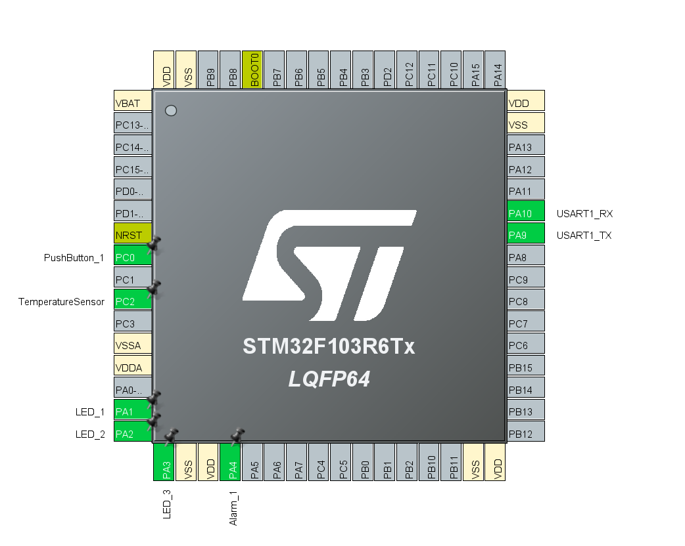
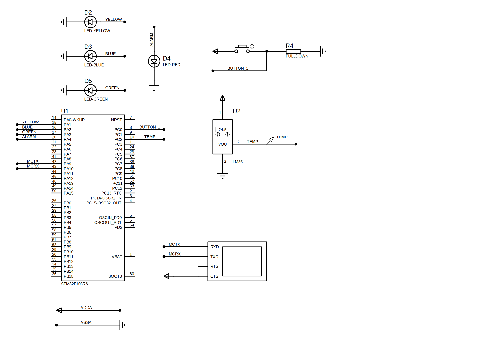

# Resource Management System with RTOS and Temperature Monitoring

An embedded systems project utilizing the STM32 platform and FreeRTOS, C and C++. The build system was generated using **CMake** and the build environment was set up using **Make**.

The hardware consisted of:
- STM32F103R6Tx MCU
- 3 LEDs representing resources
- 1 Alarm LED for error indication
- 1 temperature sensor
- 1 pushbutton, which, when pressed, consumed 1 resource for 10 seconds

Three threads were created to manage the 3 LEDs. An Interrupt Service Routine (ISR), triggered by the pushbutton, was used to release a binary semaphore for a resource thread that was in a blocked state. The resource threads would acquire a counting semaphore with a maximum count of 3. The Alarm LED would start blinking if the pushbutton was pressed more than 3 times, indicating that all resources were in use. UART was utilized to send relevant and descriptive error messages.

Finally, a high-priority producer-consumer pattern was implemented for processing temperature readings and converting them into temperature values. If the temperature fell outside a specified range, the consumer task would suspend all resource threads to prevent damage to the MCU.

This was a fun learning opportunity for several reasons:
1. **Utilizing RTOS**
2. **Managing resources** - the use of binary and counting semaphores for resource management.
3. **Implementing Interrupt Service Routines (ISRs)** - this project involved interrupt handling, i.e. implementing an ISR triggered by a pushbutton.
4. **Implementing threads** - multithreading used for management of three LEDs.
5. **High-priority task management** - implemented a high-priority producer-consumer pattern to process temperature data, suspending LED threads if temperatures deviated from set ranges.

Pinout configuration used for the project:

Circuit design:
